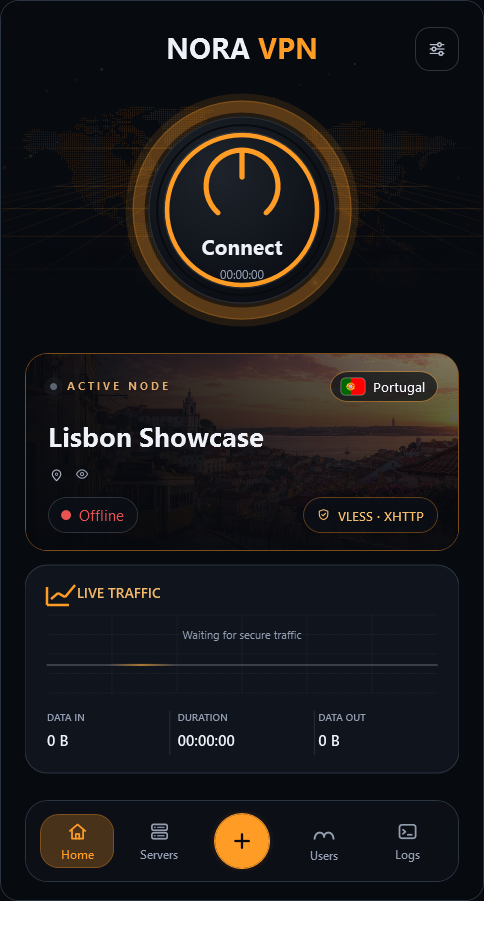
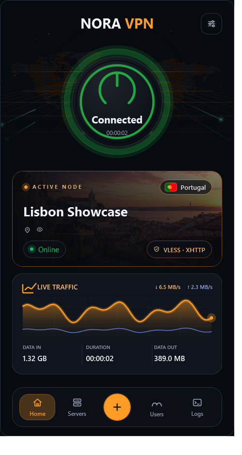
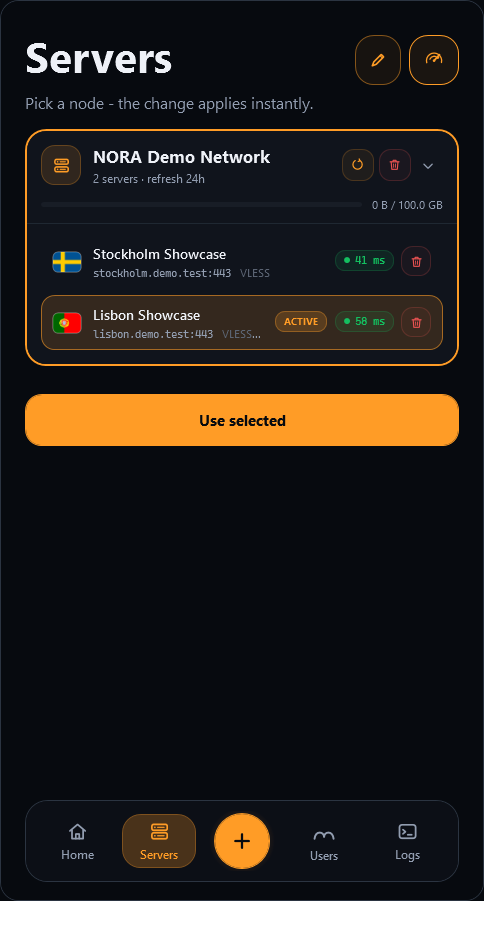

  

<h1 align="center">NORA VPN</h1>

  A visual-first Windows VPN client with self-hosted KRot, VLESS and AmneziaWG paths.

  
  
  
  

  
  
  
  

  <a href="#русская-версия">Русский</a> ·
  <a href="#english-version">English</a> ·
  <a href="docs/KROT.md">KRot</a>

<table>
  <tr>
    <td width="33.33%"></td>
    <td width="33.33%"></td>
    <td width="33.33%"></td>
  </tr>
</table>

## Русская версия

### Что это

**NORA VPN** — приложение для Windows 10 и 11. Я сделал его, чтобы VPN был
простым и визуально понятным: добавьте подписку или свой сервер, выберите
нужную локацию и подключитесь одной кнопкой.

Я хотел, чтобы VPN не выглядел как скучная техническая утилита. Поэтому в
NORA есть живой главный экран, карта, аккуратная статистика трафика и понятный
список серверов.

### Что поддерживается

- **VLESS** — ссылки `vless://`, подписки по HTTPS, Base64, Xray JSON и Clash
  YAML. Работают Reality, TLS и XHTTP.
- **AmneziaWG 2.0** — конфиги AmneziaWG и WireGuard-совместимого формата.
- **KRot / Крот** — мой экспериментальный VPN-протокол, вдохновлённый VLESS и
  AmneziaWG. В приложении можно создавать пользователей и отслеживать, сколько
  трафика они потребили.

### Что я добавил

- **Фото локаций.** Я добавил на карточку активного сервера фотографию страны
  или города вместо безликого фона. Сейчас есть изображения для
  Китая, Эстонии, Финляндии, Франции, Германии, Ирландии, Италии, Литвы,
  Нидерландов, Португалии, России, Испании, Великобритании и США.
- **Эквалайзер.** Я добавил визуальный эквалайзер, который реагирует на
  музыку и звук на компьютере.
- **Плавный Live Traffic.** График трафика движется непрерывно и мягко
  показывает изменения скорости без резких скачков между точками.
- **Диагностика подключения.** На странице Logs можно запустить проверку
  соединения и получить готовый отчёт, если VPN не подключается.

### Пресеты маршрутизации

Я добавил отдельные режимы для случаев, когда VPN нужен не всей системе.
Первый пресет — **Discord Mode**: через выбранный VPN-сервер идёт только
Discord, а остальные приложения продолжают использовать обычное подключение.

Открыть режим можно кнопкой с иконкой компьютера слева на главном экране.
Сейчас Discord Mode работает с VLESS и KRot; AmneziaWG пока не поддерживается.
Режим находится в бета-версии, поэтому возможны ошибки. В будущем я планирую
добавить больше пресетов маршрутизации.

### Что такое KRot

**KRot** — мой экспериментальный VPN-протокол, вдохновлённый VLESS и
AmneziaWG. Я сделал его для личного VPN-сервера на VPS: из NORA можно
установить узел, создавать пользователей и смотреть, сколько трафика они
потребили. Подробности — в [описании KRot](docs/KROT.md).

### Как начать

1. Скачайте portable-версию из **Releases** и распакуйте архив.
2. Запустите `NoraVPN.exe` от имени администратора.
3. На странице **Add** добавьте подписку, конфиг или свой KRot-сервер.
4. Выберите сервер на странице **Servers** и нажмите Connect.

Я распространяю NORA VPN по [Apache License 2.0](LICENSE). Название и логотип
NORA VPN описаны отдельно в [правилах использования бренда](TRADEMARKS.md).
Проекты и библиотеки, которые я использовал, указаны в [NOTICE](NOTICE) и
[THIRD_PARTY.md](docs/THIRD_PARTY.md).

---

## English version

### What it is

**NORA VPN** is a Windows 10/11 app. I built it to make VPN use simple and
clear: add a subscription or your own server, choose a location, and connect
with one button.

I wanted a VPN client that feels less like a dry technical utility. NORA has a
live home screen, a map, tidy traffic stats, and an easy-to-read server list.

### What it supports

- **VLESS** — `vless://` links, HTTPS subscriptions, Base64, Xray JSON, and
  Clash YAML. Reality, TLS, and XHTTP are supported.
- **AmneziaWG 2.0** — AmneziaWG and WireGuard-compatible configuration files.
- **KRot** — my experimental VPN protocol inspired by VLESS and AmneziaWG.
  Create users in the app and keep track of how much traffic they use.

### What I added

- **Location artwork.** I added a country or city photo to the active-server card
  instead of a generic background. Artwork is currently available for China,
  Estonia, Finland, France, Germany, Ireland, Italy, Lithuania, the Netherlands,
  Portugal, Russia, Spain, the United Kingdom, and the United States.
- **Equalizer.** I added a visual equalizer that reacts to music and other
  sound playing on your computer.
- **Smooth Live Traffic.** The traffic graph moves continuously and shows
  speed changes without abrupt jumps between samples.
- **Connection diagnostics.** The Logs page can run a connection test and
  produce a ready-to-share report when the VPN cannot connect.

### Routing presets

I added separate modes for cases where the whole system does not need to use
the VPN. The first preset is **Discord Mode**: only Discord goes through the
selected VPN server, while other apps continue using the normal connection.

Open it with the computer icon on the left side of the Home screen. Discord
Mode currently works with VLESS and KRot; AmneziaWG is not supported yet. The
mode is in beta, so bugs are possible. I plan to add more routing presets in
future releases.

### What is KRot?

**KRot** is my experimental VPN protocol inspired by VLESS and AmneziaWG. I
built it for a personal VPN server on a VPS: install a node, create users, and
see how much traffic they use from NORA. Read the [KRot overview](docs/KROT.md)
for more.

### Getting started

1. Download the portable version from **Releases** and unpack it.
2. Run `NoraVPN.exe` as administrator.
3. On **Add**, import a subscription or configuration, or add your KRot server.
4. Choose a server on **Servers** and press Connect.

I publish NORA VPN under the [Apache License 2.0](LICENSE). The NORA VPN name
and logo are covered separately by the [brand-use policy](TRADEMARKS.md). The
projects and libraries I used are listed in [NOTICE](NOTICE) and
[THIRD_PARTY.md](docs/THIRD_PARTY.md).
